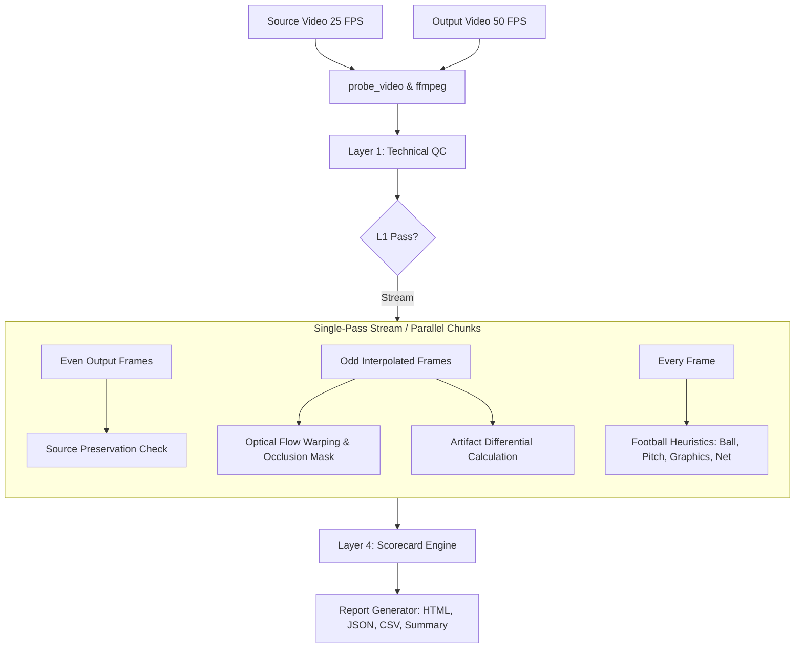
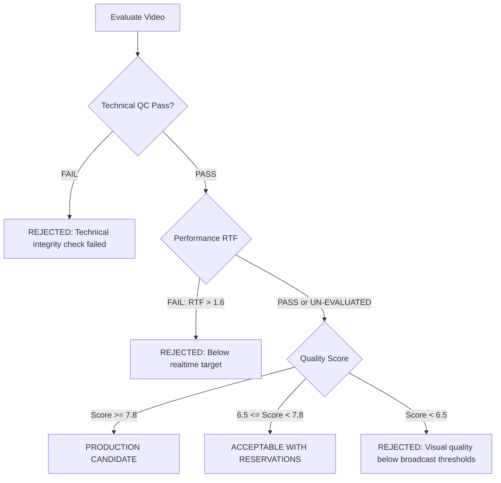

# UPFRAME Video Frame Interpolation Evaluation Process & Architecture

This document provides a comprehensive, module-by-module architectural breakdown of the **UPFRAME Evaluation Pipeline** (`eval/`). It details the mathematical principles, algorithm designs, domain-specific football heuristics, and scorecard decision criteria used to benchmark 25 FPS $\to$ 50 FPS sports video frame interpolation (VFI).

---

## Table of Contents

1. [Evaluation Philosophy & The 4-Layer Pyramid](#1-evaluation-philosophy--the-4-layer-pyramid)
2. [End-to-End Execution Flow & Pipeline Architecture](#2-end-to-end-execution-flow--pipeline-architecture)
3. [Layer 1: Technical Integrity & Container QC](#3-layer-1-technical-integrity--container-qc)
   - [1.1 Frame Counts & Nominal Framerate](#11-frame-counts--nominal-framerate)
   - [1.2 Source Frame Preservation](#12-source-frame-preservation)
   - [1.3 PTS Monotonicity & Audio Synchronization](#13-pts-monotonicity--audio-synchronization)
   - [1.4 Scene Cut Guard & Hybrid Frame Detection](#14-scene-cut-guard--hybrid-frame-detection)
4. [Layer 2: Temporal Stability & Motion Consistency](#4-layer-2-temporal-stability--motion-consistency)
   - [2.1 Optical Flow Warping & Bidirectional Occlusion Masking](#21-optical-flow-warping--bidirectional-occlusion-masking)
   - [2.2 Duration-Invariant Motion Smoothness](#22-duration-invariant-motion-smoothness)
   - [2.3 2nd-Order Temporal Difference Residual Flicker](#23-2nd-order-temporal-difference-residual-flicker)
5. [Layer 3: Football Domain-Specific Quality Control](#5-layer-3-football-domain-specific-quality-control)
   - [3.1 Ball Integrity & Pitch-Line Suppression](#31-ball-integrity--pitch-line-suppression)
   - [3.2 Player Solidity & Relative Texture Differential](#32-player-solidity--relative-texture-differential)
   - [3.3 Pitch Geometry & Perspective Angle Clustering](#33-pitch-geometry--perspective-angle-clustering)
   - [3.4 Goal Net Integrity & Structure Presence Gating](#34-goal-net-integrity--structure-presence-gating)
   - [3.5 Broadcast Graphics & Static Edge Persistence Check](#35-broadcast-graphics--static-edge-persistence-check)
   - [3.6 Added Artifact Differential & Motion Regimes](#36-added-artifact-differential--motion-regimes)
6. [Layer 4: Production Scorecard & Decision Engine](#6-layer-4-production-scorecard--decision-engine)
   - [4.1 Quality Score Calculation & Weight Re-Normalization](#41-quality-score-calculation--weight-re-normalization)
   - [4.2 Production Performance & Real-Time Factor (RTF)](#42-production-performance--real-time-factor-rtf)
   - [4.3 Automated Decision Matrix](#43-automated-decision-matrix)
7. [Diagnostics, Visualizations & Reporting](#7-diagnostics-visualizations--reporting)
8. [Parallel Processing & Multi-GPU Chunking](#8-parallel-processing--multi-gpu-chunking)
9. [CLI Quick Reference](#9-cli-quick-reference)

---

## 1. Evaluation Philosophy & The 4-Layer Pyramid

Evaluating AI video frame interpolation for televised sports broadcast (particularly 25 FPS $\to$ 50 FPS football) presents challenges that traditional full-reference metrics (like PSNR or SSIM) cannot address:
- **No Ground Truth**: Live broadcast feeds only possess the 25 FPS source; there is no real 50 FPS recording of the exact match available.
- **Fast-Moving Tiny Objects**: The football spans only 8–18 pixels across a 1080p frame and travels up to 35 m/s (~126 km/h). Deep flow models frequently erase or duplicate the ball.
- **Thin High-Frequency Meshes**: Goal nets and pitch lines bend, distort, or produce moiré patterns when interpolated.
- **Static Broadcast Overlays**: Scorebugs, club badges, and sponsor tickers must remain rock-solid without edge jitter while the camera pans rapidly beneath them.
- **Source Artifact Differential**: Broadcast source videos already contain H.264 compression artifacts, motion blur, and film grain. An evaluation system must measure **Added Distortion** ($\Delta = \text{Output} - \text{Source}$), rather than penalizing the model for flaws already present in the source.

To solve this, UPFRAME organizes evaluation into an automated **4-Layer Quality Pyramid**:

```
+-------------------------------------------------------------+
|              LAYER 4: PRODUCTION SCORECARD                  |
|    Weighted Quality Score (0-10), RTF, Candidate Verdict    |
+-------------------------------------------------------------+
                              ^
+-------------------------------------------------------------+
|              LAYER 3: FOOTBALL-SPECIFIC QC                  |
|  Ball Integrity, Pitch Lines, Goal Net, Graphics, Players   |
+-------------------------------------------------------------+
                              ^
+-------------------------------------------------------------+
|              LAYER 2: TEMPORAL & MOTION QC                  |
|  Warping Consistency, Motion Smoothness, 2nd-Order Flicker   |
+-------------------------------------------------------------+
                              ^
+-------------------------------------------------------------+
|              LAYER 1: TECHNICAL INTEGRITY                   |
|   FPS, Frame Counts, Audio Sync, PTS, Source Preservation   |
+-------------------------------------------------------------+
```

---

## 2. End-to-End Execution Flow & Pipeline Architecture

The core evaluation workflow is orchestrated by `EvaluationPipeline` ([`eval/pipeline.py`](file:///home/levantuananh/VDT_VT/video_frame_interpolation/eval/pipeline.py)):



### Key Architectural Strengths:
1. **Synchronized Single-Pass Streaming**: The pipeline consumes frames via high-performance sequential decoders (`VideoDecoder`), holding at most a 3-frame sliding window in RAM ($O(1)$ memory consumption regardless of video length).
2. **Temporal Alignment**: Output frame index mapping is strictly verified:
   $$\text{Output Even Frame } [2k] \iff \text{Source Frame } [k]$$
   $$\text{Output Odd Frame } [2k + 1] \iff \text{Interpolated Intermediate Frame}$$

---

## 3. Layer 1: Technical Integrity & Container QC

Located in [`eval/layer1_technical/`](file:///home/levantuananh/VDT_VT/video_frame_interpolation/eval/layer1_technical/).

### 1.1 Frame Counts & Nominal Framerate
- **Module**: `eval.layer1_technical.frame_counts`
- **Logic**: Inspects container metadata using FFprobe. For a source with $N_{\text{src}}$ frames at nominal framerate $F_{\text{src}}$, the target frame count is:
  $$N_{\text{expected}} = (N_{\text{src}} - 1) \times 2 + 1$$
  Output FPS must match $2 \times F_{\text{src}}$ within $\pm 0.05$ FPS tolerance. If frame counts deviate by $> 2$ frames, Layer 1 records a failure.

### 1.2 Source Frame Preservation
- **Module**: `eval.layer1_technical.source_preservation`
- **Purpose**: Verifies that the VFI engine has not corrupted original camera frames during interpolation.
- **Metrics Calculated**:
  - **PSNR**: $10 \log_{10} \frac{255^2}{\text{MSE}(I_{\text{src}}[k], I_{\text{out}}[2k])}$ (Threshold $\ge 30.0\text{ dB}$, warning if $< 35.0\text{ dB}$).
  - **SSIM**: Structural Similarity Index ($\ge 0.90$).
  - **MAE**: Mean Absolute Error ($\le 8.0\text{ px}$).
  - **Max Diff**: Maximum pixel deviation across color channels.
- **Robustness**: Stream exceptions are caught gracefully; decoder aborts are logged to structured warnings, failing preservation cleanly without swallowing root-cause errors.

### 1.3 PTS Monotonicity & Audio Synchronization
- **Modules**: `eval.layer1_technical.pts_validation`, `eval.layer1_technical.audio_sync`
- **Logic**:
  - Validates packet Presentation Timestamps ($\text{PTS}_{i+1} > \text{PTS}_i$), ensuring no backward jumps, duplicate timestamps, or irregular timestamp gaps that cause broadcast playout stutter.
  - Verifies audio presence and checks audio-video duration differential:
    $$|\Delta t_{\text{audio}}| = |T_{\text{audio}} - T_{\text{video}}| \le 0.10\text{ sec}$$

### 1.4 Scene Cut Guard & Hybrid Frame Detection
- **Module**: `eval.layer1_technical.scene_cuts`
- **Problem**: When a camera cuts from Scene A to Scene B, blind flow interpolation blends both scenes together into an unnatural "ghost hybrid" frame.
- **Algorithm**:
  1. Computes downsampled L1 luminance and histogram delta between consecutive source frames:
     $$D(I_{\text{src}}[k-1], I_{\text{src}}[k]) \ge 0.35 \implies \text{Scene Cut at } k-1$$
  2. Inspects the intermediate generated frame $I_{\text{out}}[2k - 1]$ against both scenes:
     $$\text{is\_hybrid} = \left(D(I_{\text{inter}}, I_A) > 0.20 \land D(I_{\text{inter}}, I_B) > 0.20\right) \lor \left(D(I_{\text{inter}}, \frac{I_A + I_B}{2}) < 0.12\right)$$
  3. Proper cut handling requires intermediate frame duplication (matching either Scene A or Scene B cleanly). Any hybrid blend flags a `hybrid_failure`.

---

## 4. Layer 2: Temporal Stability & Motion Consistency

Located in [`eval/layer2_temporal/`](file:///home/levantuananh/VDT_VT/video_frame_interpolation/eval/layer2_temporal/).

### 2.1 Optical Flow Warping & Bidirectional Occlusion Masking
- **Module**: `eval.layer2_temporal.optical_flow`
- **Mathematical Principle**: Given source frames $I_0, I_1$ and synthesized intermediate $I_{0.5}$:
  1. Computes dense optical flow field $\mathbf{w}_{0 \to 1} = (u, v)$ using OpenCV DIS Optical Flow (`cv2.DISOpticalFlow_PRESET_FAST` on CPU or CUDA-accelerated Dense Flow on GPU).
  2. **Forward-Aligned Backward Warping**: In `cv2.remap`, coordinates represent where each destination pixel samples from. To synthesize $I_{0.5}$ from $I_0$, the flow displacement vector must be negative:
     $$\hat{I}_{0.5}(\mathbf{x}) = I_0\left(\mathbf{x} - 0.5 \cdot \mathbf{w}_{0 \to 1}(\mathbf{x})\right)$$
  3. **Bidirectional Occlusion Masking**: Disoccluded regions have no correspondence. The pipeline computes backward flow $\mathbf{w}_{1 \to 0}$ and builds an occlusion mask $\mathcal{M}_{\text{occ}}$:
     $$\|\mathbf{w}_{0 \to 1}(\mathbf{x}) + \mathbf{w}_{1 \to 0}(\mathbf{x} + \mathbf{w}_{0 \to 1}(\mathbf{x}))\| > 1.5 + 0.05 \|\mathbf{w}_{0 \to 1}(\mathbf{x})\| \implies \text{Occluded}$$
  4. **Warping Error**: Computed exclusively over non-occluded pixels:
     $$\mathcal{E}_{\text{warp}} = \frac{1}{\sum (1 - \mathcal{M}_{\text{occ}})} \sum_{\mathbf{x}} (1 - \mathcal{M}_{\text{occ}}(\mathbf{x})) \cdot |I_{0.5}(\mathbf{x}) - \hat{I}_{0.5}(\mathbf{x})|$$

### 2.2 Duration-Invariant Motion Smoothness
- **Module**: `eval.layer2_temporal.smoothness`
- **Algorithm**:
  1. Tracks frame-to-frame global motion vectors $\mathbf{v}_t = (\Delta x_t, \Delta y_t)$ and computes temporal acceleration:
     $$\mathbf{a}_t = \|\mathbf{v}_{t+1} - \mathbf{v}_t\|$$
  2. Identifies abrupt motion discontinuities where acceleration exceeds local velocity:
     $$\mathbf{a}_t > 2.5 \times \max\left(1.0, \frac{\|\mathbf{v}_t\| + \|\mathbf{v}_{t+1}\|}{2}\right) \land \mathbf{a}_t > 3.0\text{ px}$$
  3. **Rate Normalization**: Prevents long videos from suffering unfair cumulative penalties:
     $$\text{discontinuity\_rate} = \frac{N_{\text{discontinuities}}}{N_{\text{frames}}}$$
     $$\mathcal{P}_{\text{disc}} = \min\left(0.6, \frac{\text{discontinuity\_rate}}{0.02} \times 0.6\right), \quad \mathcal{P}_{\text{jerk}} = \min\left(0.4, \frac{\bar{a}}{10.0}\right)$$
     $$\mathcal{S}_{\text{smoothness}} = \max\left(0.0, 1.0 - \mathcal{P}_{\text{disc}} - \mathcal{P}_{\text{jerk}}\right)$$

### 2.3 2nd-Order Temporal Difference Residual Flicker
- **Module**: `eval.layer2_temporal.flicker`
- **Mathematical Formulation**:
  1. 1st-order frame differences $|I_t - I_{t-1}|$ fail because fast camera panning produces large consecutive differences.
  2. The pipeline evaluates the **2nd-order temporal difference residual**:
     $$\mathcal{R}_2(t) = \left| I_t - \frac{I_{t-1} + I_{t+1}}{2} \right|$$
     For constant velocity motion, $I_t = \frac{1}{2}(I_{t-1} + I_{t+1})$, yielding $\mathcal{R}_2(t) \equiv 0$. Genuine brightness oscillations yield large non-zero residuals.
  3. Combined with high-frequency Laplacian variance oscillation:
     $$\mathcal{F}_{\text{score}} = 0.15 \cdot \overline{\mathcal{R}}_2 + 3.5 \cdot \overline{\Delta \text{Var}(\nabla^2 I)}$$

---

## 5. Layer 3: Football Domain-Specific Quality Control

Located in [`eval/layer3_football/`](file:///home/levantuananh/VDT_VT/video_frame_interpolation/eval/layer3_football/).

### 3.1 Ball Integrity & Pitch-Line Suppression
- **Module**: `eval.layer3_football.ball`
- **Detection & Suppression Pipeline**:
  ```
  Grayscale Frame
        |
  Adaptive Thresholding (high contrast)
        |
  Contour Analysis: Area (15 - 500 px), Circularity >= 0.50
        |
  Pitch-Line Suppression: Distance to extracted pitch lines <= 8 px?
        |--------> [YES] -> Suppress (White Chalk Artifact)
        |--------> [NO]  -> Valid Ball Candidate
  ```
- **Trajectory Association**: Kalman/nearest-neighbor tracking across the unbroken 50 FPS timeline with maximum displacement velocity gating:
  $$d_{\text{allowed}} = v_{\text{base}} \times (\Delta t_{\text{unseen}} + 1), \quad v_{\text{base}} = 130\text{ px at 50 FPS}$$
- **Artifact Scoring**:
  - **Ghost/Duplicate Balls**: Secondary circular candidates within $[8, 150]\text{ px}$ of the primary ball.
  - **Teleportation**: Sudden unphysical coordinate jumps beyond $d_{\text{allowed}}$.
  - **Relative Retention Gating**: Compares tracked ball frame count against source detected balls. If the ball naturally leaves the camera frame, no failure is declared.
  - **Score Formula**:
    $$\mathcal{S}_{\text{ball}} = 5.0 - \min\left(2.0, \frac{r_{\text{dup}}}{0.15} \times 2.0\right) - \min\left(1.5, \frac{r_{\text{tel}}}{0.15} \times 1.5\right) - \min\left(1.0, \frac{r_{\text{deform}}}{0.15} \times 1.0\right) - \text{Deficit}_{\text{retention}}$$

### 3.2 Player Solidity & Relative Texture Differential
- **Module**: `eval.layer3_football.player_occlusion`
- **Player Integrity**: Extracts player blobs via green-subtraction mask. Monitors bounding box contour solidity:
  $$\text{Solidity} = \frac{\text{Contour Area}}{\text{Convex Hull Area}} < 0.45 \implies \text{Solidity Anomaly (limb tearing/melting)}$$
- **Relative Occlusion Differential**:
  When two players overlap ($I_{A} \cap I_B > 8 \times 15\text{ px}$):
  $$\text{Ref Texture} = \frac{\text{Var}(\nabla^2 I_A) + \text{Var}(\nabla^2 I_B)}{2}$$
  $$\text{Overlap Texture} < \max\left(25.0, 0.35 \times \text{Ref Texture}\right) \implies \text{Occlusion Blending Failure}$$
  This avoids false positives on smooth monochrome kit fabrics while catching unnatural blurred blending artifacts when players cross paths.

### 3.3 Pitch Geometry & Perspective Angle Clustering
- **Module**: `eval.layer3_football.pitch_geometry`
- **Line Extraction**: Green pitch segmentation $\to$ dilation $\to$ Canny edge extraction $\to$ probabilistic Hough transform (`HoughLinesP`).
- **Circular Angle Manifold**:
  Angles mapped to $[0, \pi)$ using minimal circular distance:
  $$\Delta \theta(a, b) = \min(|a - b| \pmod \pi, \pi - (|a - b| \pmod \pi))$$
- **Two-Bundle Perspective Clustering**:
  Clusters detected lines into Bundle A (touchlines) and Bundle B (goal-lines / penalty box lines). Standard deviation is evaluated **within** each bundle, preventing orthogonal lines from triggering artificial wobble penalties.
- **Presence Gating**: Pitch geometry scoring is active only when grass coverage $\ge 15\%$, defaulting close-up face and bench shots to clean 5.0.

### 3.4 Goal Net Integrity & Structure Presence Gating
- **Module**: `eval.layer3_football.goal_net`
- **Structure Presence Gating**: Detects candidate goal ROIs requiring:
  - Horizontal crossbar ($\text{width} \ge 120\text{ px}, \text{aspect ratio} \ge 4.5$), OR
  - Dual vertical posts ($\text{height} \ge 70\text{ px}, \text{aspect ratio} \ge 3.5$).
- **Mesh Crispness**: If a goal is confirmed in the frame, evaluates high-frequency mesh crispness across odd/even frames:
  $$\text{Ratio} = \frac{|\bar{V}_{\text{even}} - \bar{V}_{\text{odd}}|}{\bar{V}_{\text{even}} + \epsilon} > 0.20 \implies \text{Moiré / Mesh Blurring Penalty}$$
  Midfield scenes without goals cleanly default to 5.0.

### 3.5 Broadcast Graphics & Static Edge Persistence Check
- **Module**: `eval.layer3_football.broadcast_graphics`
- **Temporal Persistence Filter**: Top-left and top-right ROIs (scorebugs, clocks, channel watermarks) accumulate Canny edge maps across frames:
  $$\bar{\mathcal{E}}(\mathbf{x}) = \frac{1}{N} \sum_{t} \mathcal{E}_t(\mathbf{x})$$
  A static scorebug requires at least 40 pixels with $\bar{\mathcal{E}} \ge 0.60$ (60% temporal permanence).
- **Jitter Isolation**: Moving grandstand crowds in the background have low permanence and are ignored. Only verified static scorebugs are evaluated for inter-frame jitter.

### 3.6 Added Artifact Differential & Motion Regimes
- **Module**: `eval.layer3_football.artifacts`
- **Differential Principle**:
  $$\Delta_{\text{artifact}} = \max\left(0.0, \text{Level}_{\text{output}} - \text{Level}_{\text{source}}\right)$$
  Evaluates added ghosting, double edges, edge tearing, and deformation.
- **Motion Breakdown**: Categorizes every odd frame into 4 dynamic regimes:
  - **Low Motion**: Flow magnitude $< 2.0\text{ px}$
  - **Medium Motion**: $2.0 \le \text{Flow} < 8.0\text{ px}$
  - **High Motion**: $8.0 \le \text{Flow} < 20.0\text{ px}$
  - **Very High Motion**: Flow $\ge 20.0\text{ px}$

---

## 6. Layer 4: Production Scorecard & Decision Engine

Located in [`eval/layer4_perceptual/scorecard.py`](file:///home/levantuananh/VDT_VT/video_frame_interpolation/eval/layer4_perceptual/scorecard.py).

### 4.1 Quality Score Calculation & Weight Re-Normalization
The production scorecard produces a weighted overall Quality Score on a $0.0\text{ to }10.0$ scale.

#### Default Scorecard Weights:
| Category | Metric Component | Base Weight |
| :--- | :--- | :--- |
| **Player Integrity** | Solidity anomalies & limb distortion | **18%** (0.18) |
| **Ball Integrity** | Teleportation, duplicates, deformation | **16%** (0.16) |
| **Temporal Stability** | Motion smoothness & residual flicker | **16%** (0.16) |
| **Occlusion Handling** | Player crossing relative texture | **12%** (0.12) |
| **Camera Motion** | Panning stability & jerkiness | **10%** (0.10) |
| **Pitch Geometry** | Line straightness & angle stability | **8%** (0.08) |
| **Broadcast Graphics** | Scorebug stability & persistence | **8%** (0.08) |
| **Goal Net** | Mesh crispness & structure preservation | **6%** (0.06) |
| **Human MOS Survey** | Subjective viewer survey (if conducted) | **6%** (0.06) |

#### Re-Normalization without Human Survey:
When automated pipelines run without human survey responses (`survey_responses_count == 0`), the remaining 8 objective weights re-normalize to sum to $1.0$:
$$w'_i = \frac{w_i}{\sum_{j=1}^{8} w_j}$$
$$\text{Quality Score (0-10)} = 2.0 \times \sum_{i=1}^{8} w'_i \cdot \mathcal{S}_i$$
This eliminates circular double-counting of objective metrics into human MOS.

### 4.2 Production Performance & Real-Time Factor (RTF)
- **Module**: `eval.performance.benchmark`
- **Real-Time Factor Formula**:
  $$\text{RTF} = \frac{\text{Total Interpolation Wall Time (seconds)}}{\text{Source Video Duration (seconds)}}$$
- **Target RTF**:
  - $\text{RTF} \le 1.0$: **Super Realtime** (Score 10.0)
  - $1.0 < \text{RTF} \le 1.3$: **Production Broadcast Target** (Score 8.5 – 10.0)
  - $1.3 < \text{RTF} \le 1.6$: **Warning** (Score 6.0 – 8.5)
  - $\text{RTF} > 1.6$: **Fail** (Score $< 6.0$)

### 4.3 Automated Decision Matrix



---

## 7. Diagnostics, Visualizations & Reporting

Located in [`eval/suspicious/`](file:///home/levantuananh/VDT_VT/video_frame_interpolation/eval/suspicious/), [`eval/visual/`](file:///home/levantuananh/VDT_VT/video_frame_interpolation/eval/visual/), and [`eval/report/`](file:///home/levantuananh/VDT_VT/video_frame_interpolation/eval/report/).

### Diagnostics:
- **Suspicious Moment Detector** (`eval.suspicious.detector`): Flags frames in the top 95th percentile of warping errors, high-motion transitions, or teleportation events for manual review.
- **Visual Difference Maps** (`eval.visual.visualizer`): Computes JET-colormap heatmap overlays ($|I_{\text{synthesized}} - \hat{I}_{\text{warped}}|$) highlighting localized distortion.
- **Slow-Motion Extraction**: Generates 25 FPS slow-motion MP4 clips with side-by-side or stacked views for visual QA inspection.

### Multi-Format Reports Generated:
1. `report.html`: Interactive dashboard with charts, KPI cards, and suspicious frame gallery.
2. `report.json`: Machine-readable metadata payload for automated CI/CD gating.
3. `metrics.csv`: Per-frame diagnostic time-series (warping error, motion magnitude, flicker).
4. `summary.txt`: Standard text-format production report.

---

## 8. Parallel Processing & Multi-GPU Chunking

Located in [`eval/parallel/engine.py`](file:///home/levantuananh/VDT_VT/video_frame_interpolation/eval/parallel/engine.py).

For large match recordings (e.g. 45-minute halves at 1080p), running single-threaded evaluation on CPU can take hours. `ParallelEvaluationEngine` distributes chunks across multiple workers and GPUs:

```
Source & Output Videos
       |
Temporal Video Chunking (with 2-frame sliding window warmup overlap)
       |
+-------------------------------------------------------+
|  Worker 0 (GPU 0)  |  Worker 1 (GPU 1)  |  Worker 2   |
|   Frames 0 - 5000  | Frames 5000-10000  |    ...      |
+-------------------------------------------------------+
       |
Map-Reduce Aggregator
  - Stitches motion vectors and accelerations
  - Combines edge accumulation arrays for graphics permanence
  - Aggregates ball trajectories and calculates duration rates
       |
Unified Scorecard & Report
```

---

## 9. CLI Quick Reference

The evaluation suite is accessible via `python -m eval.cli`:

### Standard Evaluation Run
```bash
python -m eval.cli run \
  --source match_25fps.mp4 \
  --output match_50fps_rife.mp4 \
  --model rife \
  --eval-dir evaluation_log/match_rife
```

### Multi-GPU Accelerated Parallel Run
```bash
python -m eval.cli run \
  --source match_25fps.mp4 \
  --output match_50fps_rife.mp4 \
  --model rife \
  --workers 3 \
  --gpus 0,1,2 \
  --eval-dir evaluation_log/match_rife_parallel
```

### Side-by-Side Model Benchmark
```bash
python -m eval.cli benchmark \
  --source test_videos/test_sliced.mp4 \
  --models "rife=test_rife.mp4,amt=test_amt.mp4" \
  --eval-dir evaluation_log/benchmark_comparison
```

### Full-Reference Ground Truth Run
```bash
python -m eval.cli ground-truth \
  --gt high_fps_original_50fps.mp4 \
  --output model_interpolated_50fps.mp4 \
  --eval-dir evaluation_log/gt_comparison
```

### Running Automated Test Suite
```bash
pytest tests/eval/ -v
```
