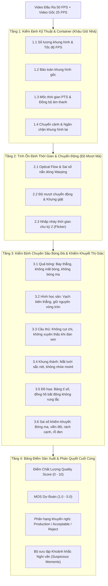

# UPFRAME Evaluation Pipeline — Cẩm Nang Hướng Dẫn Đánh Giá Toàn Diện

> **Tài liệu hướng dẫn trực quan, ngắn gọn và dễ hiểu:** Giải thích cặn kẽ **từng bước làm gì, đánh giá lỗi gì, và phương pháp trực giác đằng sau** để bao quát toàn bộ các khiếm khuyết (artifacts) trong nội suy khung hình video bóng đá từ **25 FPS lên 50 FPS**.

---

## 1. Nguyên Lý Cốt Lõi: Cơ Chế Khung Hình Chẵn vs Lẻ

Khi nhân đôi tốc độ khung hình từ **25 FPS lên 50 FPS**, video đầu ra sẽ chứa hai loại khung hình xen kẽ nhau:

```
Video Gốc 25 FPS:   [Frame 0]                    [Frame 1]                    [Frame 2]
                        │                            │                            │
                        ▼                            ▼                            ▼
Video Đầu Ra 50 FPS: [Frame 0]    [Frame 1]       [Frame 2]    [Frame 3]       [Frame 4]
                    (Gốc thật)   (AI sinh ra)    (Gốc thật)   (AI sinh ra)    (Gốc thật)
                      Chẵn           Lẻ             Chẵn           Lẻ             Chẵn
```

- **Khung hình Chẵn ($0, 2, 4, \dots$)**: Là khung hình từ camera gốc $\to$ Phải **giữ nguyên vẹn 100%**, tuyệt đối không bị mờ hay biến dạng.
- **Khung hình Lẻ ($1, 3, 5, \dots$)**: Là khung hình mới do mô hình AI nội suy thêm vào giữa $\to$ Phải nằm chuyển tiếp mượt mà, tự nhiên cả về không gian và thời gian giữa 2 khung hình thật $(F_A, F_B)$ kề trước và sau.

Hệ thống đánh giá chia quy trình kiểm định thành **4 Tầng Kim Tự Tháp**:



---

## 2. Tầng 1: Kiểm Định Kỹ Thuật & Container (Khâu "Giữ Nhà")

> *Mục đích: Đảm bảo định dạng tệp, cấu trúc luồng phát sóng và video gốc không bị hỏng trước khi phân tích từng điểm ảnh AI.*

---

### 1.1 Số lượng Khung hình & Tốc độ FPS
- **Làm gì**: Dùng FFprobe đọc metadata container và đếm chính xác số frame được giải mã.
- **Đánh giá lỗi gì**: Lỗi rơi khung hình (dropped frames), lặp hình (duplicate frames) hoặc FPS bị lệch khỏi chuẩn danh định $50.00\text{ FPS}$.
- **Trực giác phương pháp**:
  > *Bạn đặt in nhân đôi 1 album ảnh 1.000 tấm. Nếu nhận về 1.990 tấm (mất 10 tấm) hoặc 2.010 tấm (thừa 10 tấm), quy trình xuất xưởng đã gặp lỗi.*

---

### 1.2 Bảo toàn Khung hình Gốc (Source Preservation)
- **Làm gì**: So sánh từng khung hình chẵn ($I_{\text{out}}[2k]$) từng điểm ảnh với khung hình gốc tương ứng ($I_{\text{src}}[k]$) thông qua PSNR, SSIM và MAE.
- **Đánh giá lỗi gì**: Lỗi làm bẩn, làm nhòe, đổi màu sắc hoặc nén giảm chất lượng khung hình camera quay sẵn.
- **Trực giác phương pháp**:
  > *Nhiệm vụ của AI chỉ là vẽ thêm khung hình ở giữa. Những khung hình người thật quay từ trước phải giữ nguyên vẹn độ sắc nét gốc ($\text{PSNR} \ge 35\text{ dB}$, $\text{SSIM} \ge 0.90$).*

---

### 1.3 Mốc Thời gian PTS & Đồng bộ Âm thanh
- **Làm gì**: Quét từng gói tin Presentation Time Stamp (PTS) kiểm tra tính tăng đơn điệu và đo độ lệch thời lượng giữa luồng Video và Audio.
- **Đánh giá lỗi gì**: Hiện tượng đầu phát video bị giật khựng do mốc thời gian nhảy cóc, hoặc tiếng còi trọng tài / giọng bình luận viên bị trễ khỏi hình ($|\Delta t| > 0.10\text{s}$).
- **Trực giác phương pháp**:
  > *Nếu mốc thời gian nhảy lùi hoặc bước nhảy không đều, màn hình TV sẽ bị khựng giật. Nếu âm thanh trôi đi, cầu thủ sút bóng 1 giây sau người xem mới nghe thấy tiếng sút.*

---

### 1.4 Xử lý Chuyển cảnh & Khung hình Lai (Hybrid Cut Blend)
- **Làm gì**: Quét tìm điểm cắt chuyển góc máy trong video gốc ($D(F_A, F_B) \ge 0.35$). Kiểm tra khung hình nội suy ở giữa điểm cắt xem có bị hòa trộn hai cảnh hay không.
- **Đánh giá lỗi gì**: Hiện tượng "bóng ma lai ghép" (Hybrid frame) — AI nắn dòng trộn nửa mặt khán giả đè lên nửa sân cỏ.
- **Trực giác phương pháp**:
  > *Khi đạo diễn cắt từ góc toàn cảnh sân bóng sang góc cận cảnh khuôn mặt HLV, khung hình ở giữa phải nhân đôi sạch sẽ 1 trong 2 cảnh, TUYỆT ĐỐI không được hòa tan khuôn mặt HLV mờ mờ trên nền cỏ.*

---

## 3. Tầng 2: Tính Ổn Định Thời Gian & Chuyển Động (Độ Mượt Mà)

> *Mục đích: Đảm bảo chuyển động giữa các khung hình liên tiếp diễn ra êm ái, liền mạch, không gây khó chịu cho mắt người xem.*

---

### 2.1 Optical Flow & Sai số Nắn dòng (Warping Consistency)
- **Làm gì**: Ước lượng dòng chuyển động quang học 2 chiều giữa $F_A$ và $F_B$. Dùng vector này chiếu các điểm ảnh về thời điểm giữa $t=0.5$, trừ đi các vùng bị che khuất (occlusion mask), rồi so khớp với khung hình $F_X$ do AI sinh ra.
- **Đánh giá lỗi gì**: Sai số nắn dòng (warping error), các vùng điểm ảnh bị bóp méo sai quy luật vật lý.
- **Trực giác phương pháp**:
  > *Nếu cầu thủ ở vị trí $X=100$ ở frame A và chạy đến $X=120$ ở frame B, thì ở frame giữa AI phải vẽ cầu thủ ở $X=110$. Nếu vẽ cầu thủ ở $X=115$ hoặc cơ thể bị méo xộc xệch, sai số warping sẽ tăng vọt.*

---

### 2.2 Độ mượt Chuyển động & Khựng giật (Motion Smoothness)
- **Làm gì**: Theo dõi vector vận tốc toàn cục giữa các khung hình $\mathbf{v}_t = (\Delta x_t, \Delta y_t)$ và tính gia tốc tức thời $\mathbf{a}_t = \|\mathbf{v}_{t+1} - \mathbf{v}_t\|$.
- **Đánh giá lỗi gì**: Hiện tượng giật cục vi mô (micro-stutters), nhảy bước vận tốc bất thường khi camera đang lia máy.
- **Trực giác phương pháp**:
  > *Một chiếc camera truyền hình gắn trên ray trượt khi lia máy sẽ chuyển động đều theo quán tính. Nếu video lúc chạy nhanh 10px, lúc khựng lại 1px rồi lại phóng 10px, mắt người xem sẽ cảm nhận thấy hình ảnh bị giật cục rất khó chịu.*

---

### 2.3 Nhấp nháy Thời gian Chu kỳ 2 (2nd-Order Temporal Flicker)
- **Làm gì**: Đánh giá sai số vi phân bậc hai: $\mathcal{R}_2(t) = |I_t - 0.5(I_{t-1} + I_{t+1})|$.
- **Đánh giá lỗi gì**: Hiện tượng chớp nháy độ sáng hoặc độ tương phản xen kẽ giữa khung hình gốc và khung hình AI (25 lần/giây).
- **Trực giác phương pháp**:
  > *Khi lia máy đều, mặt cỏ ở frame giữa trung bình sẽ bằng nửa tổng 2 frame bên cạnh ($\mathcal{R}_2 \approx 0$). Nếu AI sinh ra khung hình bị tối hơn hoặc sáng hơn khung hình gốc, mặt cỏ sẽ chớp nháy liên hồi làm người xem nhức mắt.*

---

## 4. Tầng 3: Kiểm Định Chuyên Sâu Bóng Đá & Khiếm Khuyết Thị Giác

> *Mục đích: Bộ mắt thần thị giác máy tính chuyên biệt cho các đặc thù của bóng đá truyền hình (trái bóng siêu nhỏ chạy nhanh, vạch vôi, mắt lưới, bảng điểm).*

---

### 3.1 Tính Toàn Vẹn Quả Bóng (Triplet Ball Integrity)
- **Làm gì**:
  1. Dò tìm quả bóng trên cả hai khung hình gốc $F_A$ và $F_B$.
  2. Tính vị trí kỳ vọng vật lý ở giữa: $\mathbf{p}_{\text{exp}} = \frac{\mathbf{p}_A + \mathbf{p}_B}{2}$.
  3. Quét kiểm tra khung hình $F_X$: bóng có nằm trên đường thẳng quỹ đạo không, có bị méo mó hay sinh ra bóng thứ hai không.
  4. **Nhận diện che khuất tự nhiên**: Nếu bóng bay ra sau người cầu thủ ở $F_X$, hệ thống tự động nhận diện che khuất hợp lệ (không phạt lỗi mất bóng).
- **Đánh giá 4 lỗi bóng đá kinh điển**:
  - **Mất bóng (Ball Dissolution)**: Quả bóng đang bay bỗng dưng biến mất giữa trời.
  - **Bóng ma (Duplicate Ball)**: Xuất hiện 2 quả bóng cùng lúc trên sân.
  - **Quỹ đạo zic-zac / Nhảy bóng (Wobble/Teleportation)**: Bóng bay lượn sóng hoặc nhảy vị trí phi vật lý.
  - **Méo bóng (Deformation)**: Bóng tròn bị kéo bẹp dúm thành hình vệt dài.
- **Trực giác phương pháp**:
  > *Quả bóng chỉ rộng 10–18 pixel và bay với tốc độ hơn 100 km/h. Các mô hình AI rất hay làm mất bóng hoặc nhân đôi bóng. Thuật toán kiểm tra quỹ đạo 3 điểm đảm bảo trái bóng bay thẳng tắp từ A đến B.*

---

### 3.2 Hình Học Sân Cỏ (Pitch Geometry)
- **Làm gì**: Tách các vạch vôi trắng trên nền sân cỏ xanh và đo độ lệch mặt nạ so với trung bình tham chiếu: $\mathcal{R}_{\text{pitch}} = \text{mean}(|M_X - 0.5(M_A + M_B)|)$. So sánh độ cong đường bao với 2 khung hình gốc.
- **Đánh giá lỗi gì**: Đường biên thẳng bị biến thành lượn sóng cao su, vạch kẻ vòng cấm bị đứt đoạn hoặc nhân đôi nét.
- **Cơ chế chống phạt oan**: Vòng tròn trung tâm và vòng cung 16m50 vốn là đường cong tự nhiên. Hệ thống so khớp độ cong với khung hình gốc để nhận diện đường cong thật, **không phạt oan lỗi méo vạch**.
- **Trực giác phương pháp**:
  > *Đường biên và vạch 16m50 ngoài đời thực luôn là đường thẳng tắp. Nếu AI nắn dòng làm đường vạch uốn lượn dập dềnh như sóng nước, sai số hình học sân sẽ lập tức cảnh báo.*

---

### 3.3 Cơ Thể Cầu Thủ & Đan Xen Che Khuất (Player Solidity & Occlusion)
- **Làm gì**:
  1. **Độ đặc cơ thể (Solidity)**: Tách khối hình cầu thủ và đo tỷ lệ diện tích so với bao lồi ($\frac{\text{Area}}{\text{Convex Hull Area}}$).
  2. **Đan xen che khuất (Occlusion)**: Khi hai cầu thủ chạy lướt qua nhau ($BBox_1 \cap BBox_2$), kiểm tra độ nét chi tiết kết cấu trong vùng giao thoa so với áo của 2 cầu thủ.
  3. **Miễn trừ ngoài sân**: Không quét cầu thủ ở các góc quay khán đài hoặc cận cảnh khuôn mặt để tránh nhận nhầm khán giả.
- **Đánh giá lỗi gì**: Cụt chi (chân tay đứt rời khi chạy nhanh), cơ thể bị chảy nhão biến dạng, hoặc hai cầu thủ lướt qua nhau bị biến thành bóng mờ trong suốt (xuyên thấu).
- **Trực giác phương pháp**:
  > *Cơ thể con người là vật thể đặc. Khi hai cầu thủ chạy cắt mặt nhau, người ở trước phải che người ở sau. AI không được hòa trộn làm hai người tan vào nhau như hai bóng ma.*

---

### 3.4 Lưới Khung Thành (Goal Net Integrity)
- **Làm gì**: Tự động nhận diện cấu trúc cột dọc/xà ngang khung thành. Khi có khung thành, đo phương sai Laplacian tần số cao của mắt lưới đan xen giữa khung hình chẵn và khung hình lẻ.
- **Đánh giá lỗi gì**: Mắt lưới bị mờ tịt thành đám sương xám, rách lưới hoặc xuất hiện vân sóng moiré nhức mắt.
- **Trực giác phương pháp**:
  > *Lưới khung thành là tập hợp hàng ngàn sợi dây đan chéo dày đặc. AI kém cỏi sẽ làm nhòe mắt lưới thành một mảng mờ đục. Hệ thống kiểm tra đảm bảo mắt lưới trên khung hình AI phải sắc nét y hệt khung hình gốc.*

---

### 3.5 Đồ Họa Phát Sóng & Bảng Tỉ Số (Broadcast Graphics)
- **Làm gì**: Tích lũy bản đồ biên Canny qua nhiều khung hình ở 2 góc trên màn hình (vùng bảng tỉ số và logo/đồng hồ) để cô lập các phần tử đồ họa có độ bền vững thời gian $\ge 60\%$.
- **Đánh giá lỗi gì**: Bảng tỉ số bị rung giật viền, số phút thi đấu bị nhảy nhót rung rinh trong khi camera lia máy bên dưới.
- **Trực giác phương pháp**:
  > *Bảng tỉ số và đồng hồ là lớp đồ họa kỹ thuật số dán cố định lên màn hình. Dù camera bên dưới lia sân nhanh đến đâu, bảng tỉ số ở góc trên vẫn phải đứng yên bất động 100%.*

---

### 3.6 Bộ Đo Khiếm Khuyết Thị Giác Chung & Sai Số Gia Tăng ($\Delta$)

Tất cả các khiếm khuyết thị giác được tính theo nguyên lý **Sai số gia tăng ($\Delta = \text{Đầu Ra} - \text{Gốc}$)**:
$$\Delta_{\text{khiếm\_khuyết}} = \max\left(0, \text{Mức độ trên frame AI} - \text{Mức độ trên frame Gốc}\right)$$

> *Ý nghĩa sống còn: Video truyền hình gốc vốn đã có sẵn nhiễu nén H.264, mờ chuyển động và hạt nhiễu cảm biến. Hệ thống trừ đi mức độ nhiễu gốc để **tuyệt đối không phạt oan mô hình AI** vì những lỗi đã có từ trước trong camera.*

Hệ thống đo lường 5 loại khiếm khuyết thị giác cốt lõi:

| Loại Khiếm Khuyết | Cách Nhận Diện Bằng Toán Học & Thị Giác Máy Tính | Biểu Hiện Thực Tế |
|---|---|---|
| **1. Bóng ma (Ghosting)** | Đếm tỷ lệ điểm ảnh có độ dốc mờ nhạt nằm trong dải $5 < \|\nabla I\| < 20$. | Vệt mờ nhạt, trong suốt kéo lê đằng sau chân cầu thủ hoặc quả bóng khi di chuyển nhanh. |
| **2. Đường viền đôi (Double Contours / Halos)** | Đo giá trị đạo hàm bậc hai $|\nabla^2 I|$ (Laplacian) xung quanh viền cạnh Canny đã giãn nở. | Xuất hiện thêm một nét viền thứ hai hoặc vệt hào quang sáng chạy song song quanh người cầu thủ. |
| **3. Rách cạnh (Edge Tearing / Jaggedness)** | So sánh chu vi viền ngoài với số đỉnh đa giác xấp xỉ tối giản (`cv2.approxPolyDP`). | Đường viền cơ thể cầu thủ bị xé răng cưa lởm chởm, gãy khúc do dòng flow bị đứt đoạn. |
| **4. Biến dạng (Deformation)** | Kết hợp giữa chỉ số viền đôi và rách cạnh viền: $0.5 \cdot \text{Double} + 0.5 \cdot \text{Tearing}$. | Cấu trúc hình học vật thể bị méo mó, co dãn bất thường so với hình dáng ban đầu. |
| **5. Rỗ đen / Hạt tiêu mặt cỏ (Field Pepper Noise)** | Tìm các pixel cô lập trên nền cỏ xanh có độ sáng sụt giảm đột ngột: $\min(I_A, I_B) - I_X > 35$ và $I_X \le 40$. | Xuất hiện hàng trăm hạt đen/chấm xám li ti rải rác trên mặt cỏ xung quanh cầu thủ khi quay cận cảnh chạy nhanh. |

---

## 5. Tầng 4: Bảng Điểm Sản Xuất & Phán Quyết Cuối Cùng

> *Mục đích: Quy đổi toàn bộ các phép đo phức tạp thành một điểm số duy nhất (thang 0–10), xếp hạng phát sóng và định vị chính xác giây bị lỗi.*

---

### 5.1 Trọng Số Bảng Điểm Sản Xuất (Scorecard Weights)

Khi chạy kiểm định tự động (không có ban giám khảo con người chấm điểm), 8 tiêu chí cốt lõi được chuẩn hóa trọng số như sau:

| Tiêu Chí Đánh Giá | Đối Tượng Kiểm Soát | Trọng Số |
|---|---|:---:|
| **Toàn vẹn Cầu thủ** | Cơ thể đặc, giải phẫu người tự nhiên, không cụt chi | **19.1%** |
| **Toàn vẹn Trái bóng** | Không mất bóng, không bóng ma, quỹ đạo bay thẳng | **17.0%** |
| **Ổn định Thời gian** | Chuyển động mượt mà, không nhấp nháy chớp sáng cỏ | **17.0%** |
| **Xử lý Che khuất** | Cầu thủ đan xen không hòa tan xuyên thấu vào nhau | **12.8%** |
| **Chuyển động Camera** | Lia máy êm ái, không khựng giật gia tốc | **10.6%** |
| **Hình học Sân cỏ** | Vạch biên thẳng tắp, bảo toàn vòng tròn trung tâm | **8.5%** |
| **Đồ họa Phát sóng** | Bảng tỉ số, đồng hồ cố định bất động 100% | **8.5%** |
| **Lưới Khung thành** | Mắt lưới sắc nét, không mờ nhòe moiré | **6.4%** |

$$\text{Điểm Chất Lượng Tổng (Quality Score 0 - 10)} = 2.0 \times \sum_{i=1}^{8} w_i \cdot \mathcal{S}_i$$

---

### 5.2 Dự Đoán MOS (Predicted MOS 1.0 - 5.0)

- **MOS (Mean Opinion Score)**: Chuẩn đo lường độ hài lòng thị giác của người xem theo chuẩn quốc tế ITU-T P.910 (Thang 1.0 đến 5.0: 1 = Tệ, 3 = Tạm được, 5 = Hoàn hảo).
- **Cách tính tự động**:
  $$\text{Predicted MOS} = \frac{1}{6} \left( \mathcal{S}_{\text{player}} + \mathcal{S}_{\text{ball}} + \mathcal{S}_{\text{occlusion}} + \mathcal{S}_{\text{pitch}} + \mathcal{S}_{\text{graphics}} + \mathcal{S}_{\text{camera}} \right)$$
- **Cơ chế chống tính trùng điểm (Anti-Double-Counting)**: Nếu không có khảo sát người thật, Predicted MOS chỉ đóng vai trò hiển thị tham khảo trên báo cáo, **không được cộng dồn vào Điểm Chất Lượng 0-10** để tránh tính điểm hai lần.

---

### 5.3 Ma Trận Phán Quyết Phát Sóng (Decision Matrix)

```
                       ┌────────────────────────────────────────┐
                       │     Kiểm Định Kỹ Thuật (Tầng 1)        │
                       └────────────────────────────────────────┘
                                     │            │
                                Đạt  │            │ Thất bại
                                     ▼            ▼
                       ┌───────────────────┐ ┌──────────────────┐
                       │ Tốc Độ Xử Lý RTF  │ │     REJECTED     │
                       │   (Mục tiêu <=1.3)│ │ (Lỗi kỹ thuật)   │
                       └───────────────────┘ └──────────────────┘
                                     │
                                     ▼
                       ┌────────────────────────────────────────┐
                       │   Điểm Chất Lượng (Quality Score 0-10) │
                       └────────────────────────────────────────┘
                                     │
            ┌────────────────────────┼────────────────────────┐
            │ (Điểm >= 7.8)          │ (6.5 <= Điểm < 7.8)    │ (Điểm < 6.5)
            ▼                        ▼                        ▼
┌──────────────────────┐ ┌──────────────────────┐ ┌──────────────────────┐
│ PRODUCTION CANDIDATE │ │   ACCEPTABLE WITH    │ │       REJECTED       │
│  (Đạt Chuẩn Phát     │ │     RESERVATIONS     │ │ (Chất lượng không    │
│      Sóng)           │ │ (Cần Xem Xét Lại)    │ │   đáp ứng phát sóng) │
└──────────────────────┘ └──────────────────────┘ └──────────────────────┘
```

- **PRODUCTION CANDIDATE ($\ge 7.8$)**: Video đạt độ sắc nét tuyệt đối, bóng bay chuẩn xác, sẵn sàng phát sóng trực tiếp trên truyền hình.
- **ACCEPTABLE WITH RESERVATIONS ($6.5 - 7.8$)**: Video chấp nhận được, có một số lỗi nhỏ (như hơi mờ bóng khi chuyển động cực nhanh hoặc hơi rung nhẹ viền).
- **REJECTED ($< 6.5$ hoặc Lỗi Kỹ Thuật)**: Không đạt chuẩn phát sóng (xuất hiện bóng ma, vạch biên uốn lượn, mất bóng hoặc lệch tiếng/giật hình).

---

### 5.4 Bộ Sưu Tập Khoảnh Khắc Nghi Vấn (Suspicious Moments Gallery)

- **Cơ chế hoạt động**: Trong suốt trận đấu 90 phút (hơn 270.000 khung hình), hệ thống tự động lọc ra **top 5% khung hình có điểm số kém nhất** (sai số warping cao nhất, gia tốc giật mạnh nhất, rỗ đen nhiều nhất hoặc quỹ đạo bóng bất thường).
- **Lợi ích thực tế**: Chuyên viên kiểm duyệt chất lượng (QA) không cần phải ngồi xem hết cả trận đấu 90 phút. Chỉ cần mở báo cáo HTML và **nhấp thẳng vào các mốc thời gian nghi vấn** (ví dụ: `[26:35] - Nhiễu rỗ đen mặt cỏ`, `[08:12] - Bóng bay bất thường`) để đưa ra quyết định ngay lập tức.

---

## 6. Bảng Tra Cứu Nhanh Toàn Bộ Khiếm Khuyết (Quick Artifact Reference)

Khi gặp một hiện tượng lạ trên video nội suy, tra cứu bảng sau để biết hệ thống bắt lỗi đó như thế nào:

| Hiện Tượng Mắt Thấy | Tên Khiếm Khuyết (Artifact) | Tầng Đo Lường | Ngưỡng Báo Lỗi / Trừ Điểm |
|---|---|:---:|---|
| Mặt người hòa lẫn vào mặt cỏ khi đổi góc quay | **Khung hình lai (Hybrid Cut)** | Tầng 1 | Hiệu số tới ảnh trộn $< 0.12$ $\to$ **Fail Kỹ Thuật** |
| Video phát sóng bị khựng giật, vấp hình | **Giật PTS / Lệch nhịp FPS** | Tầng 1 | PTS không tăng đơn điệu hoặc lệch FPS $> 0.05$ |
| Giọng bình luận viên bị trễ so với hình ảnh | **Lệch tiếng (Audio Desync)** | Tầng 1 | Độ lệch thời lượng $|\Delta t| > 0.10\text{ giây}$ |
| Chuyển động lia máy bị giật cục thất thường | **Khựng chuyển động (Motion Jerk)** | Tầng 2 | Tỷ lệ giật gia tốc $> 2.0\%$ tổng thời lượng |
| Mặt cỏ chớp sáng / tối liên tục nhức mắt | **Nhấp nháy chu kỳ 2 (Flicker)** | Tầng 2 | Sai số vi phân bậc 2 $\mathcal{R}_2$ kết hợp Laplacian |
| Bóng bay bỗng nhiên biến mất giữa trời | **Mất bóng (Ball Dissolution)** | Tầng 3 | Không tìm thấy bóng trong bán kính $R$ quanh vị trí kỳ vọng |
| Có 2 quả bóng xuất hiện cùng lúc trên sân | **Bóng ma (Duplicate Ball)** | Tầng 3 | Có ứng viên tròn thứ hai nằm dọc vector chuyển động |
| Quả bóng bay lượn zic-zac gãy khúc | **Nhảy bóng (Ball Wobble)** | Tầng 3 | Độ lệch vuông góc khỏi đường thẳng quỹ đạo $> 8.0\text{ px}$ |
| Quả bóng tròn bị kéo bẹp dúm | **Méo bóng (Ball Deformation)** | Tầng 3 | Độ tròn của bóng sụt giảm $< 0.60$ so với bóng gốc |
| Vạch biên thẳng bị uốn lượn như cao su | **Vạch vôi lượn sóng (Wavy Pitch)** | Tầng 3 | Sai số mặt nạ vạch vôi $\mathcal{R}_{\text{pitch}} > 0.012$ |
| Chân tay cầu thủ bị đứt rời hoặc teo tóp | **Cụt chi / Chảy nhão (Melting)** | Tầng 3 | Độ đặc silhouette cầu thủ sụt giảm $< 0.45$ |
| Hai cầu thủ lướt qua nhau bị xuyên thấu | **Bóng ma đan xen (Occlusion Ghost)** | Tầng 3 | Kết cấu vùng giao thoa mờ tịt $< 35\%$ kết cấu áo |
| Mắt lưới khung thành bị nhòe thành đám mây | **Mờ mắt lưới (Net Mesh Blur)** | Tầng 3 | Tỷ lệ phương sai Laplacian chẵn vs lẻ lệch $> 20\%$ |
| Bảng tỉ số ở góc trên bị rung rung lắc lắc | **Rung đồ họa (Graphics Jitter)** | Tầng 3 | Độ lệch viền bảng tỉ số cố định $> 3.0\text{ px}$ |
| Vệt mờ nhạt kéo lê sau cầu thủ | **Bóng ma viền (Ghosting)** | Tầng 3 | Mức gia tăng $\Delta > 1.0\%$ so với video gốc |
| Viền cầu thủ bị xé răng cưa lởm chởm | **Rách cạnh (Edge Tearing)** | Tầng 3 | Mức gia tăng $\Delta > 1.0\%$ so with video gốc |
| Hạt đen li ti rải rác trên cỏ quanh cầu thủ | **Rỗ đen mặt cỏ (Pepper Noise)** | Tầng 3 | Điểm đen sụt sáng $> 35$ trên nền cỏ $\to$ Gắn cờ Suspicious |
